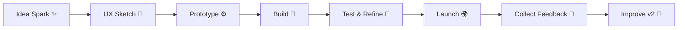

<div align="center">
  
</div>

---

## � Live Profile Stats

<p align="center">
  <a href="https://github.com/salahuddingfx">
    
  </a>

  <a href="https://github.com/salahuddingfx?tab=followers">
    
  </a>

  <a href="https://github.com/salahuddingfx?tab=repositories">
    
  </a>
</p>
---

## �👨‍💻 Welcome to My Digital Space

<p align="center">
  
</p>

<div align="center" style="margin: 20px 0;">
  
</div>

<p align="center">
  
</p>

---

## 🧭 Developer Command Center

<p align="center">
  
  
  
  
</p>

```txt
> Booting salahuddingfx.exe...
> Initializing creativity module ██████████ 100%
> Loading stack: React • Vue • Laravel • Node • Python
> Mission: Build useful products that feel magical to use ✨
```

---

## 🐍 Contribution Snake Game - Watch My Growth

<div align="center" style="margin: 20px 0; padding: 20px; background: linear-gradient(135deg, rgba(122,162,247,0.1) 0%, rgba(158,206,106,0.1) 100%); border-radius: 15px; border: 2px solid #7AA2F7;">
  <p><strong>🎮 GitHub Contribution Snake Animation</strong></p>
  
  <p style="font-size: 13px; margin-top: 10px; color: #7AA2F7;"><em>My contributions visualized as a snake eating through my commit history! 🐍</em></p>
</div>

---

## 📊 Contribution Stats & Live Activity

<div align="center" style="margin: 20px 0;">
  

  
</div>

---

## 🏆 GitHub Achievements & Trophies

<div align="center" style="margin: 20px 0; padding: 20px; background: linear-gradient(135deg, rgba(158,206,106,0.1) 0%, rgba(247,118,142,0.1) 100%); border-radius: 15px;">
  <p><strong>🎖️ My GitHub Trophy Collection</strong></p>
  
</div>

---

## 👨‍💻 About Me

**Full Stack Developer & UI/UX Designer** from **Cox's Bazar, Bangladesh** 🌴

I'm a creative developer obsessed with crafting **digital experiences** that blend aesthetics with functionality. With a passion for turning complex problems into elegant solutions, I specialize in building web applications that users love.

### 🎯 What I Do

- 🚀 **Build Modern Applications** - Crafting scalable, maintainable code with architecture that grows with your needs
- 🎨 **Design Beautiful Interfaces** - Creating intuitive UI/UX that users find delightful to interact with
- 💡 **Solve Creative Problems** - Thinking outside the box to find innovative solutions
- 🔬 **Experiment & Innovate** - Always pushing boundaries with cutting-edge technologies
- 🤝 **Collaborate Effectively** - Working seamlessly with teams to bring visions to life

### 💡 My Philosophy

> *"Great code is like great design - it's invisible to the user but makes their life better"*

I believe in writing clean, well-documented code that other developers love reading. Every project is an opportunity to create something that matters.

### 🎓 Continuous Learning

Always exploring new technologies, frameworks, and design patterns. Whether it's React, Vue, Node.js, Python, or the latest web standards - I'm committed to staying ahead of the curve.

**📧 Email:** salauddinkadrappy@gmail.com  
**🔗 Portfolio:** [salahuddingfx.blogspot.com](https://salahuddin.codes)  
📍 **Location:** Cox's Bazar, Bangladesh

---

## 🛠️ Tech Stack

### Frontend

<p>
  
</p>

### Backend

<p>
  
</p>

### Databases & Tools

<p>
  
</p>

---

## 🧠 Skill Radar (What I Bring to a Team)

| Area | Focus Level | Notes |
|---|---|---|
| Frontend Engineering | ⭐⭐⭐⭐⭐ | Pixel-perfect interfaces, reusable components, smooth UX |
| Backend Development | ⭐⭐⭐⭐☆ | APIs, auth flows, business logic, performance thinking |
| UI/UX Design | ⭐⭐⭐⭐⭐ | User-first journeys, wireframing, visual systems |
| Problem Solving | ⭐⭐⭐⭐⭐ | Break down complex requirements into clear delivery steps |
| Collaboration | ⭐⭐⭐⭐☆ | Async communication, documentation, clean handoffs |

---

## ⚒️ Creative Stack Wall

<p align="center">
  
  
  
  
</p>

<div align="center">
  
</div>

---

## 🚀 Featured Projects

### 🛍️ E-Commerce Platform

**Stack:** Laravel • Vue.js • MongoDB  
Full-featured e-commerce with payment integration and admin dashboard

### 🎮 Mobile Game

**Stack:** React Native • Node.js  
Engaging mobile game with real-time multiplayer capabilities

### 🎨 Creative Portfolio

**Stack:** Vue.js • Tailwind CSS • Figma  
Modern portfolio website showcasing design and development work

### 🤖 AI Chatbot

**Stack:** Python • Django • TensorFlow  
Intelligent chatbot with natural language processing

---

## 🧪 Labs & Experiments

<details>
  <summary><strong>✨ Click to open my experiment backlog</strong></summary>
  <br/>

- ⚡ **Micro-interactions Kit** — Building tiny UI animations that make interfaces feel alive.
- 🧭 **UX Case Notes** — Reverse-engineering great user flows from top products.
- 🤖 **AI Pair Programming Workflow** — Testing prompts and coding patterns for faster shipping.
- 📦 **Reusable Component Library** — Creating a personal design/development starter toolkit.
- 🚀 **Performance Playground** — Measuring and optimizing Core Web Vitals on sample apps.

</details>

---

## 🌐 Connect With Me

<p align="center">
  <a href="https://github.com/salahuddingfx" target="_blank">
    
  </a>
  <a href="https://linkedin.com/in/salahuddingfx" target="_blank">
    
  </a>
  <a href="https://behance.net/salahuddingfx" target="_blank">
    
  </a>
  <a href="https://dribbble.com/salahuddingfx" target="_blank">
    
  </a>
  <a href="https://twitter.com/salahuddingfx" target="_blank">
    
  </a>
</p>

---

## 💻 Languages & Tools

<p align="center">
  
</p>
---

## 📈 Activity Graph

<div align="center" style="margin: 20px 0;">
  
</div>

---

## ✨ Quick Summary

- 💼 **Experience:** Less than 1 year in Full Stack Development
- 📦 **Repositories:** 31 active projects on GitHub
- 🎓 **Focus:** Building scalable web applications with modern tech
- 🌟 **Passion:** Creating beautiful interfaces with clean code
- 🚀 **Currently:** Available for exciting projects & collaborations
- 📚 **Learning:** Latest web technologies & best practices

---

## 🎯 2026 Goals Tracker

<div align="center">
  <table>
    <tr>
      <td>🚀 Launch 3 Production Projects</td>
      <td>🟩🟩🟩⬜⬜ 60%</td>
    </tr>
    <tr>
      <td>🧠 Master System Design Fundamentals</td>
      <td>🟩🟩⬜⬜⬜ 40%</td>
    </tr>
    <tr>
      <td>🤝 Contribute to Open Source Weekly</td>
      <td>🟩🟩🟩🟩⬜ 80%</td>
    </tr>
    <tr>
      <td>✍️ Publish Technical Articles</td>
      <td>🟩⬜⬜⬜⬜ 20%</td>
    </tr>
  </table>
</div>

---

## 🗺️ Project Adventure Map



---

## 🎧 Coding Vibes

<p align="center">
  
  
  
</p>

<p align="center"><em>Building calm, thoughtful products—one commit at a time.</em></p>

---

## 🧩 Fun Developer Facts

- 🌙 Most productive coding hours: **Late evening to midnight**
- 🛠️ Favorite workflow: **Design in Figma → Build in code → Refine with user feedback**
- 🐛 Debugging superpower: **Rubber-duck + breakpoints + patience**
- 🧪 Current experiments: **AI-assisted UX, micro-interactions, and performance tuning**

### 💭 Interesting Thoughts I Build By

> "If users need a manual, the design can still be kinder."
>
> "Speed matters—but confidence in every release matters more."
>
> "The best interfaces feel obvious only *after* a lot of thoughtful iteration."

<div align="center">
  
</div>

---

## 📞 Let's Collaborate!

I'm always interested in working on interesting projects. Whether you need a full-stack developer, UI/UX designer, or want to discuss tech - feel free to reach out!

<p>
  
  
  
</p>

**Quick Links:**
- 📧 [Email Me](mailto:salauddinkadrappy@gmail.com)
- 💼 [LinkedIn Profile](https://linkedin.com/in/salahuddingfx)
- 🎨 [Portfolio Website](https://salahuddin.codes)
- 💬 [Let's Chat on Twitter](https://twitter.com/salahuddingfx)

---

<div align="center" style="margin: 30px 0;">
  
</div>

<p align="center">
  
</p>

---

<div align="center" style="margin: 20px 0; padding: 20px; background: linear-gradient(135deg, rgba(122,162,247,0.1) 0%, rgba(158,206,106,0.1) 100%); border-radius: 15px;">
  
  
  
  
  
</div>

---


