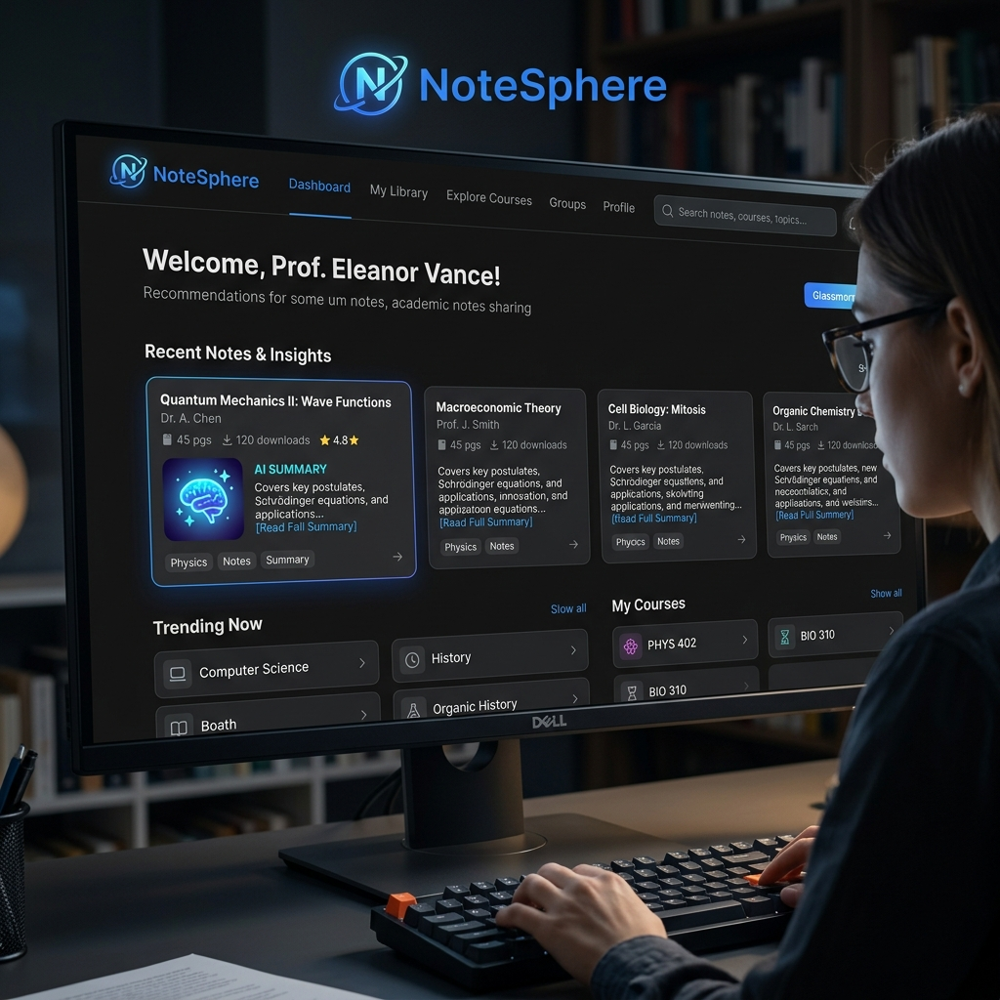
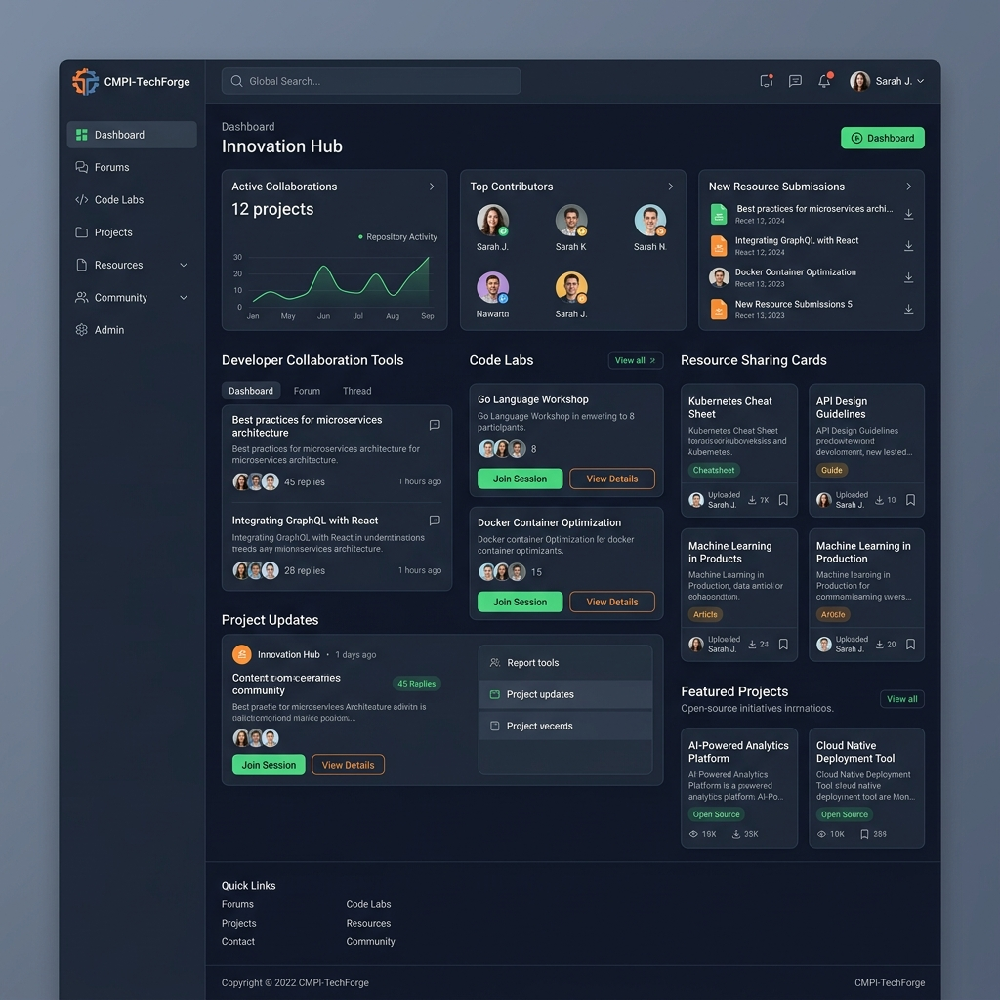
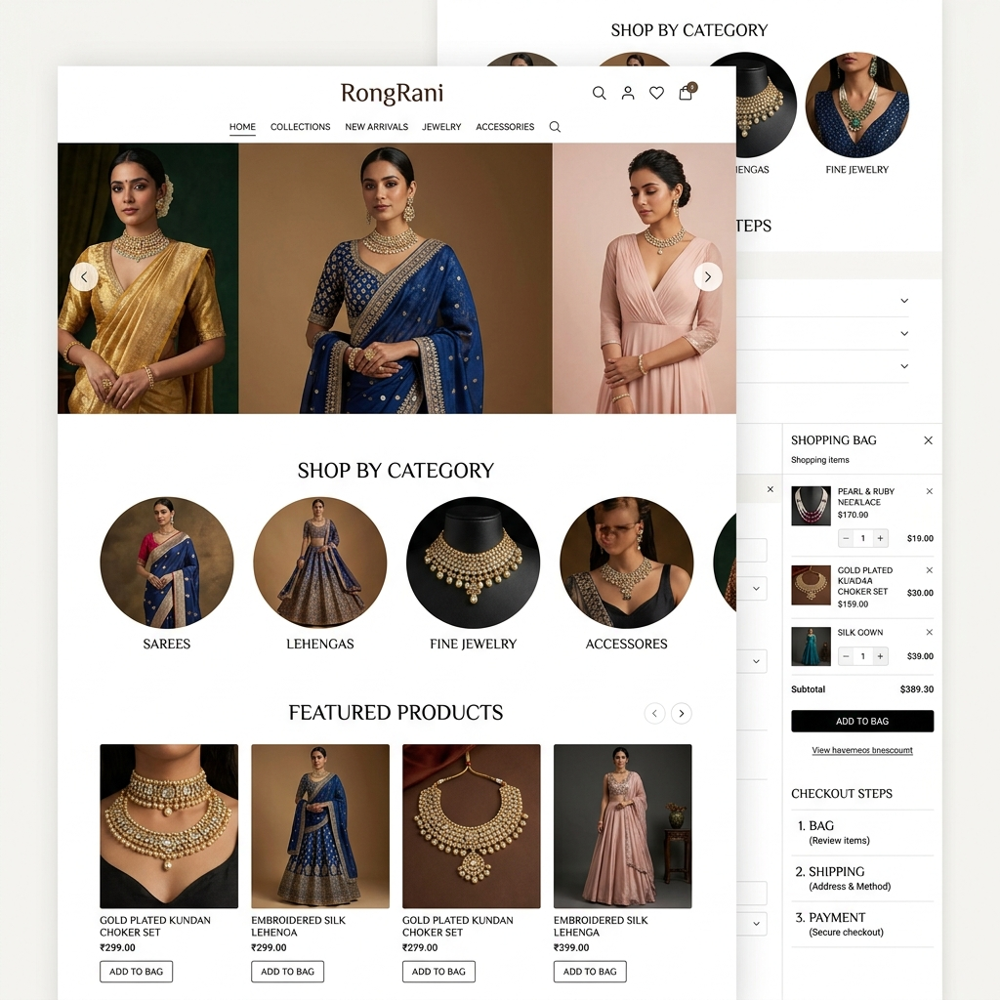
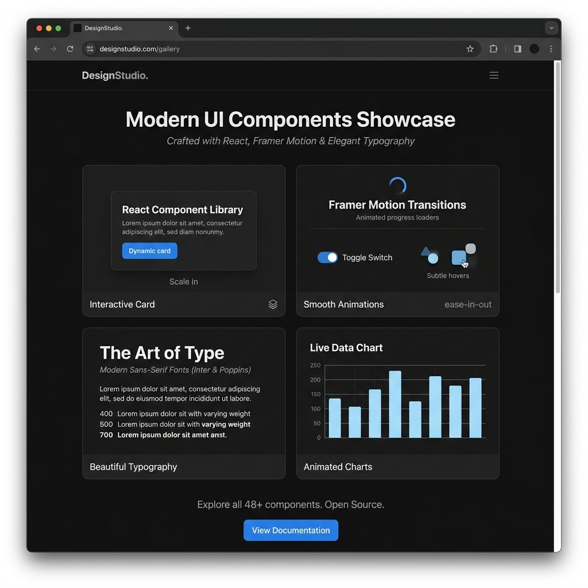

  

  

---

## ⚡ Quick Dashboard

  
  
  

  
  
  

---

## 🧔 About Me

  <table border="0">
    <tr>
      <td width="50%" valign="top">
        <h3>🚀 Beyond the Pixels</h3>
        
I'm a <strong>Full Stack Architect</strong> based in the tropical vibes of <strong>Cox's Bazar, Bangladesh</strong> 🌴. I don't just build apps; I craft <strong>digital experiences</strong> where pixel-perfect design meets high-performance logic.

        
Currently obsessed with <strong>Next.js, AI-driven UX, and Scalable Architectures.</strong>

      </td>
      <td width="50%" valign="top">
        <h3>🎨 Core Philosophy</h3>
        <blockquote>
          <em>"Great code is like great design—it's invisible to the user but makes their journey effortless."</em>
        </blockquote>
        
I believe in <strong>Minimalism, Clean Architecture,</strong> and writing code that feels like poetry to other developers.

      </td>
    </tr>
    <tr>
      <td align="center">
        
      </td>
      <td align="center">
        
      </td>
    </tr>
  </table>

### 🛠️ My Creative Workspace

  <table>
    <tr>
      <td align="center">
        
         
        <b>Avatar</b>
      </td>
      <td align="center">
        
         
        <b>Workflow</b>
      </td>
      <td align="center">
        
         
        <b>Logic</b>
      </td>
    </tr>
  </table>

---

## 🛠️ The Tech Universe (Full Stack Mastery)

  <!-- Categorized Skills -->
  <table>
    <tr>
      <td align="center" width="50%"><strong>Frontend Engineering ✨</strong></td>
      <td align="center" width="50%"><strong>Backend & Systems ⚙️</strong></td>
    </tr>
    <tr>
      <td align="top">
        
         
        

          
          
          
        

      </td>
      <td align="top">
        
         
        

          
          
          
        

      </td>
    </tr>
    <tr>
      <td align="center"><strong>Design & Creative 🎨</strong></td>
      <td align="center"><strong>DevOps & Tools 🔧</strong></td>
    </tr>
    <tr>
      <td align="top">
        
      </td>
      <td align="top">
        
      </td>
    </tr>
  </table>

---

## 🛠️ My Favorite Tools

  
  
  
  
  

---

## 🚀 Featured Projects

  <table border="0">
    <tr>
      <td width="50%" align="top">
        
        <h3>📓 NoteSphere</h3>
        
<strong>MERN Academic Hub</strong>

        
Sharing notes with AI-driven summaries, premium UI, and academic leagues.

        
        
        
        
      </td>
      <td width="50%" align="top">
        
        <h3>⚔️ CMPI-TechForge</h3>
        
<strong>MERN Community Platform</strong>

        
A robust technical community for developers to collaborate and innovate.

        
        
        
        
      </td>
    </tr>
    <tr>
      <td width="50%" align="top">
        
        <h3>🛍️ RongRani</h3>
        
<strong>Premium MERN E-Commerce</strong>

        
Full-featured e-commerce solution with dynamic imagery and real-time inventory.

        
        
        
        
      </td>
      <td width="50%" align="top">
        
        <h3>🎨 DesignStudio</h3>
        
<strong>UI/UX Showcase</strong>

        
Specialized gallery of modern UI components pushed to production standards.

        
        
        
      </td>
    </tr>
  </table>

---

## 📊 Performance Metrics & Languages

  <table border="0">
    <tr>
      <td width="50%" align="center">
        
      </td>
      <td width="50%" align="center">
        
      </td>
    </tr>
    <tr>
      <td colspan="2" align="center">
        
      </td>
    </tr>
    <tr>
      <td colspan="2" align="center">
        
      </td>
    </tr>
  </table>

### 🏆 GitHub Achievements (Hidden Gems)

  
  
  
  

---

## 📈 Activity Graph

  

---

## 🐍 Contribution Evolution

  
<strong>🎮 GitHub Contribution Snake</strong>

  
  
<em>Watch the snake eat through my commit history! 🐍</em>

---

## 🚀 Creative Journey

   ➔ 
   ➔ 
   ➔ 
  

---

## 🕒 My Developer Rhythm

  
  
  
  

---

## ✨ Quick Stats Snapshot
- 💼 **Experience:** < 1 Year (Accelerated Learning)
- 📦 **Projects:** 31+ Repositories
- 🎓 **Focus:** High-performance web apps
- 🚀 **Availability:** Open for collaboration

---

## 🎯 2026 Goals Tracker

  <table border="0">
    <tr>
      <td align="left">🚀 **Launch 5 Production Projects**</td>
      <td align="right">🟩🟩🟩🟩⬜ 80%</td>
    </tr>
    <tr>
      <td align="left">🧠 **Master Advanced System Design**</td>
      <td align="right">🟩🟩🟩⬜⬜ 60%</td>
    </tr>
    <tr>
      <td align="left">🤝 **Open Source Contributions**</td>
      <td align="right">🟩🟩🟩🟩⬜ 80%</td>
    </tr>
    <tr>
      <td align="left">✍️ **Technical Blogging**</td>
      <td align="right">🟩🟩⬜⬜⬜ 40%</td>
    </tr>
    <tr>
      <td align="left">🤖 **AI Workflow Integration**</td>
      <td align="right">🟩🟩🟩🟩🟩 100%</td>
    </tr>
  </table>

---

## 🌐 Let's Connect

  
  
  
  

  

**Quick Links:**
- 📧 [Email Me](mailto:salauddinkadrappy@gmail.com)
- 💼 [LinkedIn Profile](https://linkedin.com/in/salahuddingfx)
- 💬 [Let's Chat on X](https://twitter.com/salahuddingfx)

---

## 🎧 Coding Vibes

  
  
  

<em>Building calm, thoughtful products—one commit at a time.</em>

---

## 🧠 Dev Insights & Philosophy

  
  
  

> *"Debugging is like being the detective in a crime movie where you are also the murderer."* 🕵️‍♂️

---

## 🧩 The Human Side
- 🌙 **Peak Productivity:** 9 PM - 2 AM (The silent hours of innovation)
- 🧪 **Currently Exploring:** AI-driven UI transitions, Web3, and Micro-interactions
- 🎨 **Beyond Code:** Professional Graphic Design, Photography, and exploring nature's aesthetics

---

## 💡 Random Dev Wisdom

  

---

## 🤝 Support & Collaborate

  
  

---

## 📅 My Typical Coding Hours

  <table>
    <tr>
      <td><strong>Monday - Friday</strong></td>
      <td><strong>Saturday - Sunday</strong></td>
    </tr>
    <tr>
      <td><code>09:00 AM - 02:00 AM</code> (Hyperfocus)</td>
      <td><code>10:00 AM - 12:00 AM</code> (Creative Mode)</td>
    </tr>
  </table>

---

  

---

  
  
  

---

